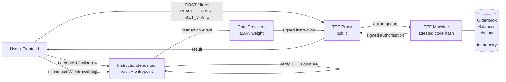
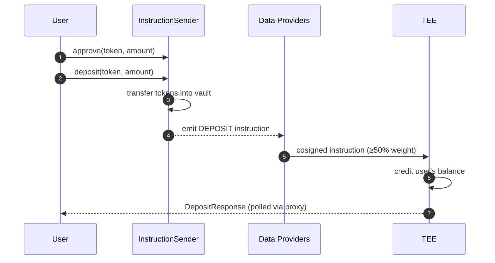
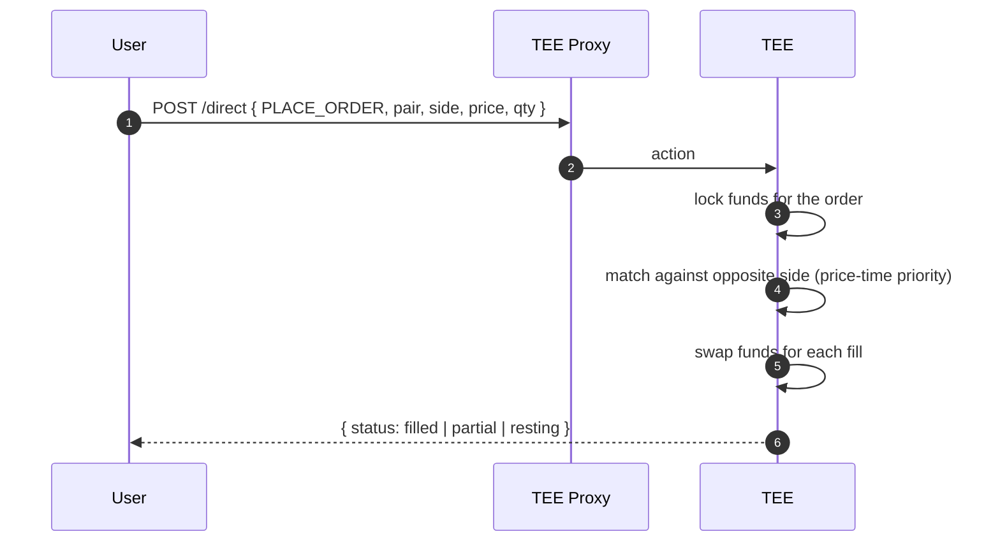
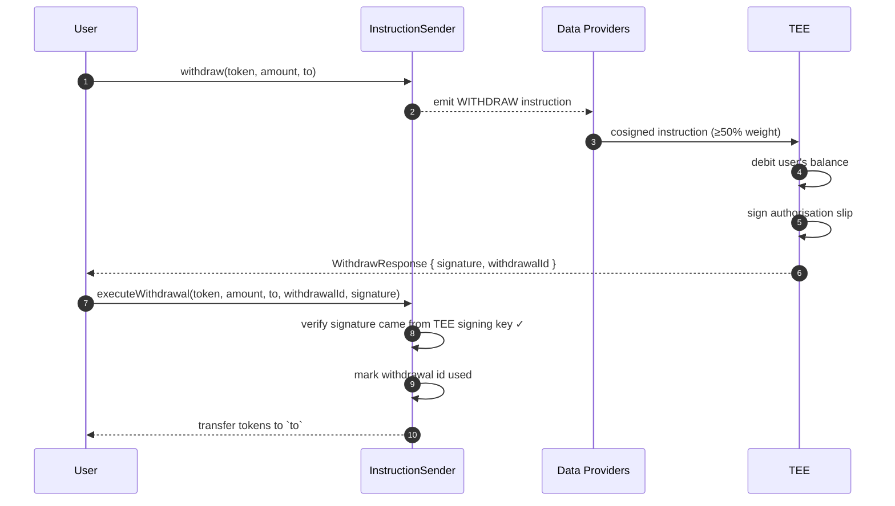

# Confidential Orderbook on Flare

> A reference exchange implementation for **Flare Confidential Compute (FCC)**. Matching runs inside a TEE, open orders never touch the chain, and withdrawals are authorised by a TEE signature that the on-chain vault verifies before releasing funds.


This repository is aimed at teams evaluating FCC as a platform for a **serious on-chain product** — exchanges, structured-product vaults, settlement layers, or anything where pure smart contracts can't give you the privacy, fairness, or custody you need. The orderbook is deliberately non-trivial: price-time priority matching, real deposit and withdrawal custody, a working frontend, and a load-testing harness. Use it as a template, not a toy.

---

## TL;DR

- **Private orderbook.** Open orders live only in TEE memory — never on-chain, never in a public mempool, never in the proxy's logs. No book-level MEV, no front-running, no sandwich attacks on resting orders.
- **Fair, deterministic matching.** Price-time priority, enforced by code that's pinned to a hash registered on-chain. Fills happen instantly inside the TEE — no per-fill gas, no on-chain settlement round trip.
- **Trust-minimised custody.** An on-chain vault holds tokens. Funds release only when the TEE produces a signed authorisation — and the TEE's signing key never leaves attested hardware and is backed up across data providers, so no single operator can drain the vault.
- **Uses the full FCC platform.** On-chain instructions for deposits and withdrawals, off-chain direct actions for trading and reads, and outbound TEE signatures for settlement. All three integration paths are used here, end-to-end.
- **Production-shaped.** Reproducible Docker build, Foundry contracts, a working trading frontend, end-to-end tests, and a load generator that runs from a one-minute smoke to multi-day soak.

---

## Why Build This on FCC?

A classic on-chain orderbook is stuck between three bad options: keep orders on-chain and watch them get front-run, encrypt them with heavy cryptography that's expensive and fragile, or run matching off-chain with centralised custody and end up rebuilding a centralised exchange. FCC lets the book stay private *and* the custody stay trust-minimised at the same time.

Three concrete properties fall out of this repo:

1. **Orders are private while they rest.** The matching engine exists only inside the TEE. The proxy sees opaque action bodies; the chain sees nothing until a withdrawal is executed. A trader's intent doesn't leak between submission and match.
2. **Matching is deterministic and attested.** The exact code that runs the matching is pinned to a hash registered on-chain. Changing it requires a public, governable rollout — not a silent server swap. What you audit is what runs.
3. **Custody follows the signature, not the operator.** The vault releases funds on a signature from the TEE, not on a call from a privileged operator. You don't trust the team running the TEE — you trust the code hash and the data-provider consensus that admits it.

What FCC does **not** give you: instructions are "fire and forget" (no ordering across submissions), the public proxy can delay or censor inbound actions, and a compromised TEE hardware vendor is out of scope. See [Security Model](#security-model) for a full list.

---

## Architecture



There are exactly three ways into a TEE and one way back out:

| Direction | Channel | Used for |
|---|---|---|
| In (on-chain) | `InstructionSender.sol` → data providers → proxy → TEE | `DEPOSIT`, `WITHDRAW` — actions that must be tied to a real on-chain transaction |
| In (off-chain) | Frontend → proxy → TEE (a "direct action") | `PLACE_ORDER`, `CANCEL_ORDER`, `GET_MY_STATE`, `GET_BOOK_STATE` — trading and reads |
| Out | TEE → proxy → user → chain | `executeWithdrawal(sig)` — user presents a TEE-signed authorisation to the vault |

The orderbook, the per-user balance ledger (available + held), and the pending-order state live entirely in the TEE's memory. Nothing is persisted outside of it except the audit trail a user can pull with `EXPORT_HISTORY`.

---

## How Users Interact

### 1. Deposit



The user approves the vault and calls `deposit(token, amount)`. ERC20 tokens move to the vault; the vault emits a `DEPOSIT` instruction. Data providers cosign it, the proxy forwards it to the TEE once the consensus threshold is met, and the TEE credits the user's available balance in memory. The frontend polls the proxy for the result.

The on-chain transfer *is* the authorisation — there is no separate signed deposit message. That's deliberate: only deposits that actually happened on-chain can credit a balance, because every instruction has to be cosigned above the consensus threshold before the TEE will act on it.

### 2. Trade

Placing and cancelling orders never hits the chain. The frontend sends a **direct action** straight to the proxy:



Inside the TEE, the order's funds are moved from available to locked, and the matching engine walks the opposite side of the book in price-time priority. Every fill is an atomic swap between maker and taker — no per-fill settlement, no signatures, no gas. If only part of an order fills, the rest stays resting in the TEE until it's matched or cancelled.

Reads use the same channel and are gasless: `GET_MY_STATE` returns the caller's balances, open orders, and personal trade history; `GET_BOOK_STATE` returns public depth and recent matches.

### 3. Withdraw — the novel part

Withdrawal is a **two-step, two-transaction** flow, and this is where the TEE-as-custodian model does its real work:



1. The user calls `withdraw(token, amount, to)` on the vault. This relays a `WITHDRAW` instruction to the TEE via the data providers.
2. Inside the TEE, the request is checked against the user's available balance, the balance is debited, and the TEE signs an authorisation slip carrying the token, amount, destination, and a unique withdrawal id.
3. The signed slip comes back through the proxy to the user.
4. The user (or anyone, on their behalf) submits `executeWithdrawal(...)` with the slip. The vault verifies the signature came from the registered TEE signing address, marks the withdrawal id used so it can't be replayed, and transfers the tokens.

The important consequence: **anyone** can broadcast `executeWithdrawal`. The signature is the authorisation, not the caller. That makes gas sponsorship, meta-transactions, and asynchronous settlement trivial to build on top — the vault doesn't need to know who the user is, only that the TEE said "pay `to`, once, for this amount".

The TEE's signing address is registered on the vault exactly once, at setup. Rotating it requires a new deployment (or a deliberate governance extension you add). A rogue operator can't silently swap signers.

For the exact signature preimage and on-chain verification logic, see [docs/flows/withdrawal.md](docs/flows/withdrawal.md).

---

## Security Model

**What the TEE guarantees**

- **Code attestation.** Every signed action is produced by a TEE binary whose code hash is registered on-chain. Changing matching, fees, or withdrawal logic requires registering and rolling out a new hash — a visible, governable event.
- **Consensus on inbound instructions.** On-chain `DEPOSIT` and `WITHDRAW` instructions are only executed if signed by data providers holding ≥50% of the current epoch's weight (up to 100 providers per 3.5-day rotation).
- **Replay protection.** Each withdrawal carries a unique id, generated on-chain. The vault rejects any id it has already executed.
- **Key resilience.** The TEE's signing key is split across data providers using Shamir secret sharing. Losing a single TEE doesn't leak the key, and the signing identity survives a TEE replacement.
- **In-memory isolation.** Order state, pending matches, and per-user balances never leave the TEE's attested address space unless a user explicitly exports their own history.

**What the TEE does not guarantee**

- **Ordering.** FCC is explicitly "fire and forget": two direct actions submitted in quick succession may arrive at the TEE in either order. The matching engine is designed around this — it is single-writer per pair — but any logic you add on top must be safe without ordering assumptions.
- **Liveness.** The public proxy can delay or drop actions. Withdrawals remain recoverable via the consensus-signed on-chain instruction path, but a sustained proxy outage halts new trading.
- **Hardware trust.** If a TEE vendor is compromised or the attestation chain is broken, the code-hash guarantee collapses. This is mitigated operationally — running across multiple TEE vendors, rotating attestation — not by FCC itself.

---

## Try It Locally

Bring up the chain, proxy, TEE, and extension in one command:

```bash
./scripts/full-setup.sh 
```

Then start the frontend:

```bash
cd frontend && npm install && npm run dev
```

Open `http://localhost:5173`. The footer shows **NETWORK COSTON2** and **TEE ONLINE** when everything is connected. Use the in-app faucet to get test tokens, deposit into the vault, and place your first order.

---

## Testing

- **Unit and end-to-end tests** — `go test ./...` plus a scripted E2E runner. See [docs/testing.md](docs/testing.md).
- **Stress and soak** — a multi-persona load generator with tiers ranging from a one-minute smoke to multi-day soak runs with live price oracles. See [docs/stress-test.md](docs/stress-test.md).

---

## Further Reading

- [docs/architecture.md](docs/architecture.md) — full system map: contracts, Go packages, state model, signing architecture
- [docs/flows/deposit.md](docs/flows/deposit.md), [orders.md](docs/flows/orders.md), [withdrawal.md](docs/flows/withdrawal.md) — per-flow deep dives with ABI layouts and code refs
- [docs/extension-guide.md](docs/extension-guide.md) — extension internals, if you want to fork this as a template for your own product
- [docs/instruction-sender.md](docs/instruction-sender.md) — on-chain contract patterns
- [docs/types-server.md](docs/types-server.md) — how the proxy decodes extension payloads
- [docs/testing.md](docs/testing.md) — test runner, unit + integration setup
- [docs/stress-test.md](docs/stress-test.md) — load generator and soak profiles

---

## Built On

Flare Confidential Compute — see the [FCC overview](https://dev.flare.network/fcc/overview) for the underlying primitives (extensions, signing policies, data providers, attestation, Protocol Managed Wallets).
