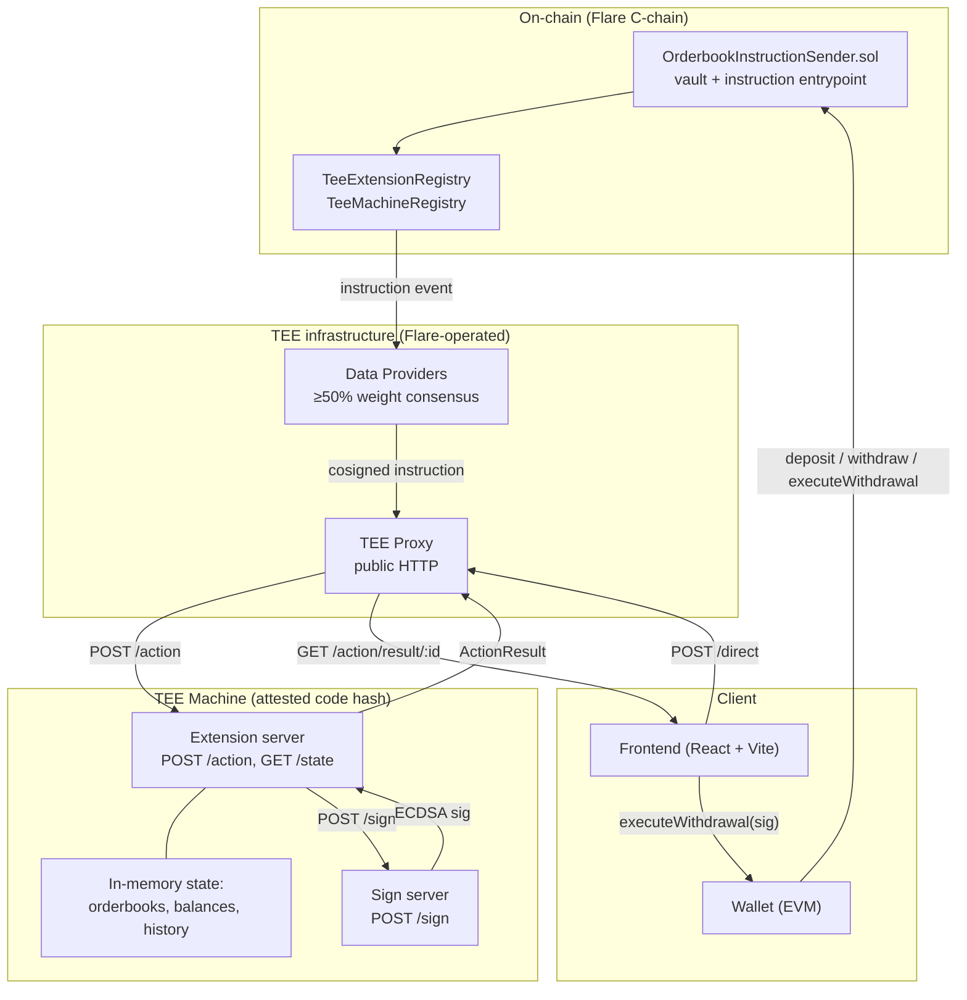

# Architecture

This document maps the whole system — contracts, Go packages, frontend, and the TEE proxy in between — and shows how a request flows through them. For step-by-step detail on each user-facing operation, see the [per-flow docs](flows/).

## Components

The system has four layers. The TEE machine is the only one that sees cleartext order state.

### On-chain

- **`contracts/InstructionSender.sol`** — `OrderbookInstructionSender`. Holds deposited ERC20 tokens as a vault, sends `DEPOSIT`/`WITHDRAW` instructions to the TEE via the extension registry, and verifies TEE-signed authorisations before releasing funds in `executeWithdrawal`. Carries an optional KYC allowlist (off by default) and a write-once `teeAddress` that identifies the authorised withdrawal signer.
- **`TeeExtensionRegistry` / `TeeMachineRegistry`** — Flare-side registries (interfaces in `contracts/interfaces/`). `_sendInstruction` selects a random registered TEE for the extension and emits the instruction; data providers pick up the event and relay it.

### TEE infrastructure

- **Data providers** — validators for the current signing-policy epoch (up to 100 providers per 3.5 days). Each cosigns inbound instructions; the TEE only acts on an instruction once its signatures cross 50%+ weight.
- **TEE proxy** — the only public HTTP surface. Accepts on-chain instructions from data providers and off-chain *direct actions* from clients, queues them, and delivers each as an `Action` to the extension. Stores `ActionResult`s keyed by action ID so clients can poll.

### TEE machine (this repo)

- **Extension server** — `internal/extension/extension.go`. Exposes `POST /action` (the only route the proxy calls) and `GET /state` (unauthenticated public depth). `processAction` dispatches by action type (`Instruction` vs `Direct`) and then by `OPCommand`.
- **Sign server** — a separate HTTP endpoint on the same TEE (`localhost:{signPort}/sign`) backed by a key that only exists inside the attested TEE. The extension POSTs a raw message; the sign server keccak256's it, wraps in EIP-191, signs, and returns an ECDSA signature. See [flows/withdrawal.md](flows/withdrawal.md) for the exact preimage.
- **In-memory state** — orderbooks (one per pair), balance manager (available + held per `(user, token)`), per-user deposit/withdraw/order/match history, the active-order → pair map used to route cancels. Nothing is persisted.

### Client

- **Frontend** — React + Vite (`frontend/`). Uses the browser wallet for on-chain actions and hits the TEE proxy directly for trading and state reads. See `frontend/README.md` for dev setup.

## Go package layout

| Package | Purpose |
|---|---|
| `cmd/main.go` | Standalone extension entry point for local dev |
| `cmd/docker/main.go` | Combined TEE node + extension + types server for the Docker image |
| `cmd/types-server/main.go` | Standalone types server (decodes extension payloads for the proxy) |
| `internal/config/` | `OPType`/`OPCommand` constants, trading pair config, ports, admin addresses |
| `internal/extension/` | All `processX` handlers; extension state; HTTP mux |
| `pkg/orderbook/` | Matching engine — `OrderBook`, `OrderSide`, `Order`, `Match`, `PriceLevel` |
| `pkg/balance/` | Per-(user, token) ledger with `Available`/`Held`, `Hold`/`Release`/`Transfer` |
| `pkg/types/` | Wire types for requests/responses, plus decoder registration for the types server |
| `pkg/decoder/` | Generic JSON and ABI decoder framework used by the types server |
| `pkg/server/` | `StartExtension()` / `StartTypesServer()` lifecycle wrappers |
| `tools/` | Separate Go module: deploy, register, run-test, stress-test binaries |

## Request types

The extension handles three distinct action shapes. They share `POST /action` but differ in how they reach it.

### 1. On-chain instruction (`Action.Data.Type == Instruction`)

- Emitted by `OrderbookInstructionSender` on the chain.
- Relayed through data providers and the proxy.
- Body parsed as `instruction.DataFixed` — includes `OPType`, `OPCommand`, `InstructionID`, and `OriginalMessage` (the ABI-encoded payload the contract sent).
- Dispatched by `processInstruction` (`internal/extension/extension.go:125`).
- Used for: `DEPOSIT`, `WITHDRAW`.

### 2. Direct action (`Action.Data.Type == Direct`)

- Posted by any client straight to the proxy's `/direct` endpoint.
- Body parsed as `teetypes.DirectInstruction` — `OPType`, `OPCommand`, plus an opaque `Message` (JSON).
- Dispatched by `processDirect` (`internal/extension/extension.go:156`).
- Used for: `PLACE_ORDER`, `CANCEL_ORDER`, `GET_MY_STATE`, `GET_BOOK_STATE`, `EXPORT_HISTORY`.

### 3. Public state read (`GET /state`)

- Direct HTTP call, no proxy indirection — returns current depth and recent matches.
- Used by the frontend for unauthenticated market data (no sender required).

## OP codes

Constants live in `internal/config/config.go` and must match the Solidity constants in `contracts/InstructionSender.sol` byte-for-byte.

| OPType | OPCommand | Path | Handler |
|---|---|---|---|
| `ORDERBOOK` | `DEPOSIT` | on-chain instruction | `processDeposit` |
| `ORDERBOOK` | `WITHDRAW` | on-chain instruction | `processWithdraw` |
| `ORDERBOOK` | `PLACE_ORDER` | direct action | `processPlaceOrder` |
| `ORDERBOOK` | `CANCEL_ORDER` | direct action | `processCancelOrder` |
| `ORDERBOOK` | `GET_MY_STATE` | direct action | `processGetMyState` |
| `ORDERBOOK` | `GET_BOOK_STATE` | direct action | `processGetBookState` |
| `ORDERBOOK` | `EXPORT_HISTORY` | direct action | `processExportHistory` |

## State model

All state lives in the `Extension` struct (`internal/extension/extension.go:42`) and is entirely in-memory:

| Field | Shape | Notes |
|---|---|---|
| `orderbooks` | `map[pair]*OrderBook` | One per configured trading pair |
| `balances` | `*balance.Manager` | `Available` + `Held` per `(user, token)` |
| `pairs` | `map[pair]TradingPairConfig` | Base/quote token addresses |
| `orders` | `map[orderID]pair` | Active-order-to-pair index for cancel routing |
| `userOrders` | `map[user][]orderID` | Per-user active order list |
| `matches` | `[]Match` | Global recent-match tape |
| `history` | `*History` | Per-user deposits, withdrawals, orders (all), matches |
| `admins` | `map[user]bool` | For `EXPORT_HISTORY` cross-user access |

A single `sync.RWMutex` protects writes; per-orderbook `sync.RWMutex`es inside `OrderBook` protect the per-pair book. The matching engine is single-writer per pair.

### Restart behaviour

A TEE restart wipes in-memory state. Deposits and withdrawals are recoverable in principle from on-chain events, but **this repo does not implement recovery** — resting orders are lost on restart, and balances must be rebuilt before the extension is safe to serve trading again. If you fork this for a production system, add an on-chain event replayer in `Extension.New` and persist (or re-derive) the balance ledger before opening the `/action` endpoint. See [flows/orders.md](flows/orders.md#restart-and-persistence) for the tradeoffs.

## Price and quantity encoding

All internal amounts are `uint64` in token *smallest units* (wei for 18-decimal tokens). Prices are stored multiplied by a fixed `pricePrecision = 1000` (`internal/extension/handlers.go:25`) so that three decimal places of price resolution are available without pulling in big-integer arithmetic. Any quote-token amount is computed as `quantity * price / 1000`. The frontend must apply the same factor when submitting orders.

This means a "0.998 FLR/USDT" order is submitted with `price = 998`, and a sell of 10 FLR at that price holds `10 * 998 / 1000 = 9.98 USDT`-worth of quote tokens (scaled).

## Signing architecture

Only one outbound TEE signature exists in this extension: the withdrawal authorisation.

- The signing key is held by the TEE's **sign server**, a sibling process on the same machine. The extension binary never sees the private key — it calls `POST /sign` over localhost.
- The sign server applies `keccak256` and the EIP-191 prefix internally. The extension sends the raw preimage (`abi.encodePacked(token, amount, to, withdrawalId)`), and the contract's `_recoverSigner` reconstructs the same digest for `ecrecover`.
- The signing address is registered on-chain as `teeAddress` via a one-time admin call to `setTeeAddress`. The contract rejects any withdrawal whose signature doesn't recover to this address.
- Backend key resilience is handled by the FCC protocol layer (Shamir secret sharing across data providers) — out of scope for this repo. See the [FCC overview](https://dev.flare.network/fcc/overview).

## Configuration surface

- **Trading pairs** — loaded from `config/pairs.json` at extension startup, seeded by `tools/cmd/test-setup` during `./scripts/full-setup.sh`. Each pair declares a name, base token address, and quote token address.
- **Admin addresses** — `internal/config/config.go` lists admin EOAs. Admins can call `setTeeAddress`, `setKycEnabled`, `allowUser` on the contract, and pass `targetUser` to `EXPORT_HISTORY` for cross-user audit.
- **Ports** — extension HTTP, sign server, types server. Defaults in `internal/config/config.go`; overrides via env vars.

## Entry points and scripts

- `./scripts/full-setup.sh --test` — one-shot: pre-build → extension setup (pairs, mint, approve) → docker compose up → post-build (register TEE) → end-to-end test.
- `./scripts/start-services.sh` — bring services up/down without re-building.
- `tools/cmd/stress-test` — multi-persona load generator; see [stress-test.md](stress-test.md).
- `tools/cmd/test-setup` — deploys test tokens, writes `config/pairs.json`, performs mints and approvals.

## Where to look next

- [flows/deposit.md](flows/deposit.md) — on-chain `DEPOSIT` path, ABI layout, response shape
- [flows/orders.md](flows/orders.md) — direct-action trading, matching engine internals, partial fills, cancels
- [flows/withdrawal.md](flows/withdrawal.md) — the two-step TEE-signed authorisation flow, signature preimage, replay protection
- [extension-guide.md](extension-guide.md) — forking this as a template
- [instruction-sender.md](instruction-sender.md) — on-chain contract patterns
- [types-server.md](types-server.md) — how the proxy decodes extension payloads for observability
