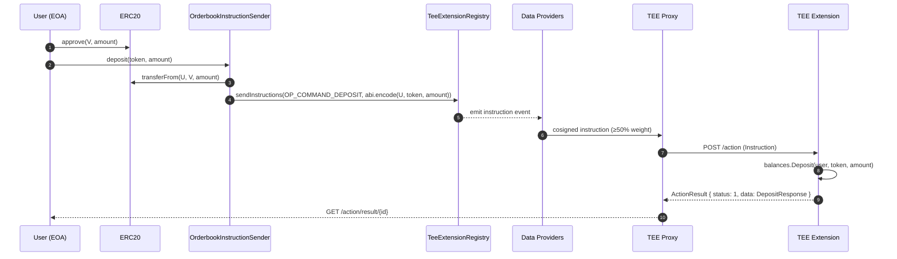

# Deposit Flow

A deposit moves ERC20 tokens from a user's EOA into the on-chain vault and credits the user's available balance inside the TEE. It is an **on-chain instruction**: the on-chain transfer *is* the authorisation, and the data-provider consensus guarantees the TEE only credits balances for instructions that actually happened on-chain.

For the broader architecture context see [../architecture.md](../architecture.md).

## End-to-end sequence



## On-chain entry point

`OrderbookInstructionSender.deposit` (`contracts/InstructionSender.sol:126`):

```solidity
function deposit(address token, uint256 amount) external payable {
    require(!kycEnabled || allowed[msg.sender], "not allowed to deposit");
    require(amount > 0, "zero amount");
    require(IERC20(token).transferFrom(msg.sender, address(this), amount), "transferFrom failed");

    bytes memory message = abi.encode(msg.sender, token, amount);
    _sendInstruction(OP_COMMAND_DEPOSIT, message);
}
```

Two things to note:

- **Optional KYC gating.** `kycEnabled` defaults to `false`, so deposits are open. When admins flip it on (`setKycEnabled(true)`), only addresses in the `allowed` mapping can deposit. Admins populate the allowlist via `allowUser` / `removeUser`.
- **`msg.sender` goes into the message.** The TEE needs to know *who* is depositing. Because data providers reproduce the instruction from the on-chain event independently, the sender field can't be spoofed — a forged instruction wouldn't match any real transaction.

The `payable` modifier is for the value forwarded to `TEE_EXTENSION_REGISTRY.sendInstructions` to pay instruction-relaying fees (see `instruction-sender.md`). The ERC20 itself is moved by `transferFrom`, not by `msg.value`.

## Instruction payload ABI

The message is **ABI-encoded** (not packed):

```
abi.encode(
    address sender,   // 32 bytes (left-padded)
    address token,    // 32 bytes (left-padded)
    uint256 amount    // 32 bytes
)
```

Total: 96 bytes. The TEE decodes this via `decodeDepositMessage` (`internal/extension/deposit.go:59`) using `github.com/ethereum/go-ethereum/accounts/abi`.

> **ABI-encoded, not packed.** Compare this to the withdrawal signature preimage, which *is* packed (`abi.encodePacked`). Getting the two mixed up is a classic signature-verification bug. See [withdrawal.md](withdrawal.md#why-packed-vs-encoded-matters) for the full rationale.

## TEE handler

`Extension.processDeposit` (`internal/extension/deposit.go:20`):

```go
func (e *Extension) processDeposit(action teetypes.Action, df *instruction.DataFixed) teetypes.ActionResult {
    sender, token, amount, err := decodeDepositMessage(df.OriginalMessage)
    if err != nil { return buildResult(action, df, nil, 0, …) }

    user := strings.ToLower(sender.Hex())
    if amount == 0 { return buildResult(action, df, nil, 0, …) }

    if err := e.balances.Deposit(user, token, amount); err != nil { … }

    // ... record in history ...

    resp := types.DepositResponse{ Token: token, Amount: amount, Available: bal.Available }
    return buildResult(action, df, marshal(resp), 1, nil)
}
```

Step by step:

1. **Decode.** ABI-unpack the 96-byte message into `(sender, token, amount)`. A decode error fails the action — the on-chain `transferFrom` already happened, so the user's tokens are stuck in the vault and they need an admin or manual recovery. In practice this branch is unreachable because the contract constructs the message with the right types.
2. **Normalise the user key.** All per-user maps key on lower-cased hex (`strings.ToLower(sender.Hex())`) so that addresses submitted from different casings (direct actions from the frontend vs instructions from Solidity) hit the same bucket.
3. **Credit the balance.** `balance.Manager.Deposit` adds to the user's `Available` counter for the given token. Held balances are untouched.
4. **Record history.** Append a `DepositRecord` with the current timestamp to the per-user history — surfaced later by `EXPORT_HISTORY`.
5. **Return response.** `DepositResponse` contains the credited amount and the new `Available` balance. The proxy stores this; the frontend polls `GET /action/result/{id}` and parses it.

There is no per-deposit on-chain event emitted back from the TEE — the response is returned asynchronously via the proxy's result store.

## Response shape

```go
type DepositResponse struct {
    Token     common.Address `json:"token"`
    Amount    uint64         `json:"amount"`
    Available uint64         `json:"available"`
}
```

Note the numeric fields are `uint64`, not `uint256`. Amounts are in token smallest units (wei for 18-decimal tokens). This caps a single balance at ~1.8e19, which is fine for test tokens but something to revisit for mainnet assets — see [Limits](#limits-and-edge-cases).

## Frontend integration

The frontend sends the deposit transaction through the user's wallet, then polls for the TEE's result:

```ts
// 1. approve + deposit on-chain (wagmi / ethers)
await erc20.write.approve([VAULT, amount]);
const { hash } = await vault.write.deposit([token, amount], { value: instructionFee });

// 2. extract the instruction ID from the transaction receipt
const instructionId = extractInstructionId(await publicClient.waitForTransactionReceipt({ hash }));

// 3. poll the proxy for the TEE's DepositResponse
const result = await teeClient.pollResult<DepositResponse>(instructionId);
// result.available is the new available balance
```

The `instructionFee` forwarded with `deposit(...)` pays the data providers for relaying; the price is quoted by the extension registry.

## Failure modes

| Failure | Where | Effect |
|---|---|---|
| `transferFrom` returns false | contract | Transaction reverts; no instruction emitted; no tokens moved. |
| KYC enabled + caller not allowed | contract | Transaction reverts. |
| Data providers don't reach 50%+ weight | proxy | Instruction sits in the proxy queue indefinitely; tokens stuck in the vault. Operational issue. |
| TEE restarts before crediting | TEE | In-memory credit is lost. **This repo does not replay deposits on startup.** See [../architecture.md#restart-behaviour](../architecture.md#restart-behaviour). |
| `amount == 0` after decode | TEE | `ActionResult` status = 0; tokens are still in the vault. The contract already rejects zero-amount deposits, so this is defence in depth. |
| ABI decode fails | TEE | `ActionResult` status = 0. Same stuck-in-vault issue. In practice unreachable for instructions sent by the official contract. |

## Limits and edge cases

- **`uint64` amount cap.** A single deposit larger than `math.MaxUint64` (~1.8e19) would silently truncate in `amountBig.Uint64()` at `internal/extension/deposit.go:93`. For an 18-decimal token, that's ~18 tokens' worth of precision overhead before you saturate — fine for test tokens, not fine for mainnet USDC without changing the type.
- **No idempotency check on `InstructionID`.** The deposit handler does not dedupe against `df.InstructionID`. If the proxy somehow delivers the same action twice, the balance would be credited twice. The data-provider layer is responsible for at-most-once delivery — trust is placed there, not in the handler.
- **No cross-pair coupling.** The balance manager is pair-agnostic; a deposited token becomes available across every orderbook that uses it.

## Related

- [withdrawal.md](withdrawal.md) — the outbound signed path
- [orders.md](orders.md) — what deposited balances are actually used for
- [../instruction-sender.md](../instruction-sender.md) — the on-chain instruction pattern used by `deposit`
