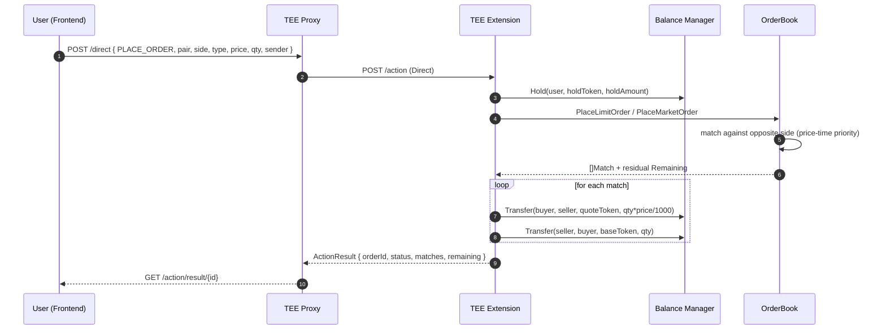

# Order Flow

Orders — placements, cancellations, and every fill that happens between them — never touch the chain. They travel as **direct actions** between the frontend and the TEE, and the matching engine runs entirely inside attested TEE memory. This is what makes the book private.

For the broader architecture context see [../architecture.md](../architecture.md). For deposits (which top up the balance an order holds against) see [deposit.md](deposit.md).

## End-to-end sequence



There is no on-chain transaction here and no TEE-signed output. The entire flow is request → in-memory mutation → response.

## Request shape

`PlaceOrderRequest` (`pkg/types/types.go:44`):

```go
type PlaceOrderRequest struct {
    Sender   string              `json:"sender"`   // user address, lowercase hex
    Pair     string              `json:"pair"`     // e.g. "FLR/USDT"
    Side     orderbook.Side      `json:"side"`     // "buy" | "sell"
    Type     orderbook.OrderType `json:"type"`     // "limit" | "market"
    Price    uint64              `json:"price"`    // scaled by pricePrecision=1000
    Quantity uint64              `json:"quantity"` // base-token smallest units
}
```

The `sender` field identifies the trader. The TEE takes this at face value within the scope of the matching engine — **direct actions are authenticated at the proxy/wallet layer, not re-verified in the handler**. That is a deliberate simplification for this reference implementation; in production you would bind the request to a wallet signature and verify it here. See [Threat model caveats](#threat-model-caveats).

### Price encoding

`price` is stored multiplied by `pricePrecision = 1000` (`internal/extension/handlers.go:25`). A human-visible price of 0.998 is submitted as `998`. Every quote-token amount the TEE computes from a price is divided back out (`qty * price / 1000`). The frontend must apply the same factor on submission and the inverse on display.

## Placement — step by step

`Extension.processPlaceOrder` (`internal/extension/handlers.go:28`):

### 1. Validate the pair

```go
pairConfig, ok := e.pairs[req.Pair]
if !ok { … }
ob, ok := e.orderbooks[req.Pair]
if !ok { … }
```

Pairs are loaded from `config/pairs.json` at startup; unknown pairs are rejected.

### 2. Build the order and calculate the hold

```go
holdToken, holdAmount, err := e.calculateHold(user, pairConfig, order)
```

`calculateHold` (`internal/extension/handlers.go:262`) determines what the trader is locking up:

| Side | Type | Hold token | Hold amount |
|---|---|---|---|
| Buy | Limit | pair.QuoteToken | `qty * price / 1000` |
| Buy | Market | pair.QuoteToken | entire available quote balance |
| Sell | Limit | pair.BaseToken | `qty` |
| Sell | Market | pair.BaseToken | entire available base balance |

Market orders pre-authorise the whole available balance because we don't yet know how much they'll consume; any unused portion is released after matching (step 5).

### 3. Hold funds

```go
if err := e.balances.Hold(user, holdToken, holdAmount); err != nil {
    return buildResult(…, "insufficient balance")
}
```

`Hold` moves the amount from `Available` to `Held` atomically inside the balance manager. If the user doesn't have enough available balance, the order is rejected before it touches the book.

### 4. Match

```go
switch req.Type {
case orderbook.Limit:  matches, err = ob.PlaceLimitOrder(order)
case orderbook.Market: matches, err = ob.PlaceMarketOrder(order)
}
```

Matching details are in [Matching engine](#matching-engine) below. The key output is `[]Match`, one entry per fill.

### 5. Settle the matches

```go
e.mu.Lock()
for _, m := range matches {
    e.processMatch(m, pairConfig)
}

if req.Type == orderbook.Market {
    filled := totalFilled(matches, order)
    if filled < holdAmount {
        _ = e.balances.Release(user, holdToken, holdAmount-filled)
    }
}
// ... track the order if Remaining > 0 ...
e.mu.Unlock()
```

`processMatch` (`internal/extension/handlers.go:195`) is where funds actually change hands:

```go
quoteAmount := m.Quantity * m.Price / pricePrecision
_ = e.balances.Transfer(buyOwner, sellOwner, pairConfig.QuoteToken, quoteAmount)
_ = e.balances.Transfer(sellOwner, buyOwner, pairConfig.BaseToken, m.Quantity)
```

Two `Transfer` calls per match: held quote goes from buyer to seller; held base goes from seller to buyer. Both sides' `Held` decreases and the other's `Available` increases. This is the only write path for settlement in the entire system.

For a market order, any unused pre-authorised hold is returned to `Available` via `Release`.

### 6. Response

```go
resp := types.PlaceOrderResponse{
    OrderID:   order.ID,                // e.g. "ORD-1713945123456789-42"
    Status:    "filled" | "partial" | "resting",
    Matches:   matches,                  // fills that just happened
    Remaining: order.Remaining,          // residual size left on the book
}
```

## Matching engine

Implementation: `pkg/orderbook/orderbook.go`, `pkg/orderbook/orderside.go`.

Each `OrderBook` owns two `OrderSide`s — `bids` (descending price) and `asks` (ascending price). An `OrderSide` is backed by:

- A red-black tree keyed on price (`github.com/emirpasic/gods/v2/trees/redblacktree`) whose comparator puts the *best* price at the root.
- A `container/list.List` per price level, holding `*Order`s in arrival order.
- An `orderID → orderLocation` map for O(1) removal by ID.

### Price-time priority

Matching walks the best-price level first (tree root), fills orders from the front of that level's FIFO queue (earliest first), and moves to the next level once the current one is empty. The execution price is always the **resting** order's price — the incoming order crosses to the resting side. This is classic CLOB semantics.

`matchBuy` loop (`pkg/orderbook/orderbook.go:118`):

```go
for order.Remaining > 0 {
    bestPrice, queue, ok := ob.asks.BestPrice()
    if !ok { break }                                   // no liquidity
    if limitPrice > 0 && bestPrice > limitPrice { break } // price exhausted for a limit order
    matches = ob.fillFromQueue(order, queue, bestPrice, matches)
    if queue.Len() == 0 { ob.asks.priceLevels.Remove(bestPrice) }
}
```

`matchSell` is the symmetric inverse. `limitPrice == 0` is the sentinel for "no price limit" (market order).

### Fill execution

`fillFromQueue` (`pkg/orderbook/orderbook.go:170`) takes the front of the queue, fills up to `min(incoming.Remaining, resting.Remaining)` at the resting price, decrements both, and removes the resting order if it hits zero:

```go
fillQty := min64(incoming.Remaining, resting.Remaining)
// ... build Match m, append ...
incoming.Remaining -= fillQty
resting.Remaining  -= fillQty
if resting.Remaining == 0 { queue.Remove(front); /* delete from side.orders, decrement count */ }
```

A `Match` (`pkg/orderbook/order.go:31`) records both order IDs, both owners, the pair, the executed price, the fill quantity, and a nanosecond timestamp.

### Limit vs market

| Type | Stops when | Residual |
|---|---|---|
| `Limit` | opposite side's best price crosses past `order.Price` | rests on the book |
| `Market` | opposite side is empty, or this order's remaining is 0 | discarded; market orders never rest |

A market order with no liquidity on the opposite side returns `ErrNoLiquidity` and the hold is released in `processPlaceOrder`'s error path.

### Partial fills

If a limit order partially fills (`Remaining > 0 && len(matches) > 0`), the unfilled remainder is added to its side via `OrderSide.Add` and will be matched later by a future incoming order. Its status is `"partial"` and the frontend keeps it in "open orders" until it's filled or cancelled.

### Determinism and fairness

Given the same starting book state and the same sequence of incoming orders, the matching result is deterministic — the tree comparator is total, the queue is FIFO, and there's no wallclock-dependent branching in the match path. Attestation of the code hash therefore doubles as attestation of matching behaviour.

The `time.Now().UnixNano()` call inside `fillFromQueue` is only used for the `Match.Timestamp` output; it doesn't affect which orders match.

## Cancel flow

`processCancelOrder` (`internal/extension/handlers.go:136`):

1. Look up the order's pair from the `e.orders` index.
2. Call `OrderBook.CancelOrder(orderID, user)` — this removes from the appropriate side and verifies `order.Owner == user` (re-inserting if ownership doesn't match, so a spoofed cancel leaves the book intact).
3. Release the held funds: for a buy, `remaining * price / 1000` of quote; for a sell, `remaining` of base.
4. Clean up the user's active-order list.

Ownership enforcement: `CancelOrder` (`pkg/orderbook/orderbook.go:83`) checks `order.Owner != owner` *after* removing and puts the order back if the caller isn't the owner. This means a spoofed cancel costs a tree lookup but leaves state unchanged.

## Read paths

Two direct actions return state without mutating it:

- **`GET_MY_STATE`** (`userstate.go`) — returns the caller's `Available`/`Held` per token, their open orders, and their personal match history. Filtered to `sender`.
- **`GET_BOOK_STATE`** (`bookstate.go`) — aggregated public depth (price levels and their total quantity) and recent matches. Same shape as `GET /state` but delivered via the proxy's `/direct` path so clients that can only reach the proxy still work.

Both are gasless, return in a single round trip, and don't require holds.

## Restart and persistence

The orderbook, user-order indices, match tape, and history all live in `Extension` (see [../architecture.md#state-model](../architecture.md#state-model)) and are in-memory only. A TEE restart means:

- Every resting order is lost. Users must re-place.
- Per-user balances are lost unless you've added a replayer on top.
- The match tape and per-user history are lost.

For production forks, the usual shapes are (a) persist deposits/withdrawals and rebuild balances from them, treating open orders as ephemeral, or (b) emit a signed state snapshot periodically and restore from the latest snapshot plus subsequent events.

## Threat model caveats

This reference implementation trusts the `sender` field in direct actions. That is fine for a demo — the proxy operator can at worst impersonate users within their own balances — but a production deployment must **bind the request to a wallet signature** and verify it before holding funds or placing orders. Otherwise anyone who can reach the proxy can cancel other users' orders and drain their hold-backed positions by placing and cancelling in a loop. The hook for this is inside `processPlaceOrder`/`processCancelOrder` after the JSON decode and before the balance `Hold` — add a signature check over the request bytes against `req.Sender`.

## Failure modes

| Failure | Where | Effect |
|---|---|---|
| Unknown pair | TEE | Rejected before hold. No state change. |
| Insufficient available balance | balance manager | Hold fails, order never reaches the book. |
| Invalid side / type / price / qty | matching engine | Hold has been placed; the calling handler releases it on the error path. |
| Market order with no liquidity | matching engine | Returns `ErrNoLiquidity`; handler releases the hold. |
| TEE crash mid-match | TEE | See [Restart and persistence](#restart-and-persistence). |

## Frontend integration

`frontend/src/lib/orderbook.ts` wraps the direct-action calls. Sending an order and polling for the result:

```ts
const res = await sendDirectAndPoll<PlaceOrderResponse>({
  opCommand: "PLACE_ORDER",
  message: { sender, pair: "FLR/USDT", side: "buy", type: "limit", price: 998, quantity: 10_000 },
});
// res.status == "filled" | "partial" | "resting"
```

The UI keeps a local "open orders" list synced against periodic `GET_MY_STATE` calls, updates the depth chart from `GET_BOOK_STATE`, and refreshes the recent-trades tape from the `matches` array that comes back on each place.

## Related

- [deposit.md](deposit.md) — where the balances an order holds against come from
- [withdrawal.md](withdrawal.md) — pulling filled balances back to your wallet
- [../architecture.md#op-codes](../architecture.md#op-codes) — the full list of direct-action OPCommands
