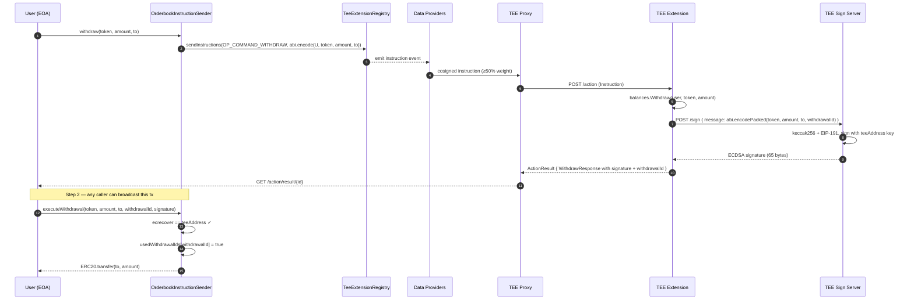

# Withdrawal Flow

A withdrawal pulls funds back out of the vault. This is where the TEE-as-custodian model earns its keep: the vault contract releases tokens only on presentation of an ECDSA signature from an address (`teeAddress`) whose private key exists only inside TEEs running the registered code hash. The chain doesn't trust the operator — it trusts the code hash and the data-provider consensus that admitted it.

For the broader architecture context see [../architecture.md](../architecture.md).

## Why two transactions

Withdrawal is a **two-step, two-transaction** flow:

1. **On-chain `withdraw(token, amount, to)`** — relays a `WITHDRAW` instruction to the TEE. The TEE debits the user's in-memory balance and returns an ECDSA signature over the withdrawal parameters.
2. **On-chain `executeWithdrawal(token, amount, to, withdrawalId, signature)`** — any caller submits the signed parameters; the vault verifies the signature and transfers the tokens.

Doing it in one transaction would require either the TEE to submit the unlock itself (which makes the operator responsible for liveness and gas), or signing synchronously inside a chain-native call (which TEE instructions can't do — they're asynchronous by design). Splitting the two transactions makes the vault strictly a verifier. Anyone can broadcast `executeWithdrawal`; the signature is the authorisation, not the caller.

## End-to-end sequence



## Step 1 — request the signed authorisation

### Contract

`OrderbookInstructionSender.withdraw` (`contracts/InstructionSender.sol:143`):

```solidity
function withdraw(address token, uint256 amount, address to) external payable {
    bytes memory message = abi.encode(msg.sender, token, amount, to);
    _sendInstruction(OP_COMMAND_WITHDRAW, message);
}
```

No on-chain checks beyond the `payable` instruction-fee plumbing. The TEE is the authority on "does this user actually have the balance". If the user lies or races, the TEE's debit fails and no signature is returned.

The **instruction payload** is ABI-encoded:

```
abi.encode(
    address sender,  // 32 bytes
    address token,   // 32 bytes
    uint256 amount,  // 32 bytes
    address to       // 32 bytes
)
```

Total: 128 bytes. Note this is `abi.encode`, not `abi.encodePacked` — the signature preimage (below) uses packed encoding and is a different thing.

### TEE handler

`Extension.processWithdraw` (`internal/extension/withdraw.go:24`):

```go
func (e *Extension) processWithdraw(action teetypes.Action, df *instruction.DataFixed) teetypes.ActionResult {
    sender, token, amount, to, err := decodeWithdrawMessage(df.OriginalMessage)
    if err != nil { return buildResult(…) }

    user := strings.ToLower(sender.Hex())
    if amount == 0 { return buildResult(…) }

    if err := e.balances.Withdraw(user, token, amount); err != nil { … }

    withdrawalID := df.InstructionID
    message := packWithdrawalMessage(token, amount, to, withdrawalID)

    sig, err := e.signWithTEE(message)
    if err != nil {
        _ = e.balances.Deposit(user, token, amount)   // rollback on sign failure
        return buildResult(…)
    }

    // ... record history ...

    resp := types.WithdrawResponse{
        Token: token, Amount: amount, To: to,
        WithdrawalID: withdrawalID, Signature: sig, Available: bal.Available,
    }
    return buildResult(action, df, marshal(resp), 1, nil)
}
```

Key decisions:

- **Debit before sign.** The balance is decremented before asking the sign server. If the TEE grants a signature it has already committed the debit, and the on-chain `executeWithdrawal` will succeed against a matching `withdrawalId`. If the sign call fails (sign server down, etc.) the handler explicitly re-credits the balance before failing the action.
- **`withdrawalId = df.InstructionID`.** The instruction ID is a `bytes32` unique to each on-chain `withdraw` call. Reusing it as the withdrawal nonce means the vault's `usedWithdrawalIds` mapping and the TEE's in-memory debit both key off the same identifier — no separate nonce generator, no sync problem.

### Signature preimage

`packWithdrawalMessage` (`internal/extension/withdraw.go:83`) produces the raw bytes the sign server hashes:

```
abi.encodePacked(
    address token,        // 20 bytes
    uint256 amount,        // 32 bytes (big-endian, zero-padded from uint64)
    address to,            // 20 bytes
    bytes32 withdrawalId   // 32 bytes
)
```

Total: **104 bytes**. This is the packed encoding — no padding between fields — because Solidity's `abi.encodePacked` and `keccak256(abi.encodePacked(...))` are what the contract's `_recoverSigner` reconstructs.

### Why packed vs encoded matters

The on-chain instruction message is `abi.encode(...)` (128 bytes, fully padded) because the TEE uses the standard ABI decoder to parse it back into typed values. The signature preimage is `abi.encodePacked(...)` (104 bytes, minimally encoded) because packed encoding is shorter and is the Solidity convention for `keccak256` input — both sides have to agree. Mixing them up is the canonical signature-verification bug. The Go and Solidity sides are explicit:

- `internal/extension/withdraw.go:79-95` documents the packed layout and constructs it byte-by-byte.
- `contracts/InstructionSender.sol:165` reconstructs it: `keccak256(abi.encodePacked(token, amount, to, withdrawalId))`.

The `uint64` amount in Go is widened to 32 bytes via `new(big.Int).SetUint64(amount).FillBytes(buf)` so it lines up with Solidity's `uint256`.

### Signing

`Extension.signWithTEE` (`internal/extension/withdraw.go:99`) POSTs the raw message to the sign server:

```go
url := fmt.Sprintf("http://localhost:%d/sign", e.signPort)
resp, err := http.Post(url, "application/json", bytes.NewReader(reqBody))
```

The sign server is a sibling process on the same TEE. Its responsibility is to:

1. `keccak256` the incoming message.
2. Prefix with EIP-191: `"\x19Ethereum Signed Message:\n32" || hash`.
3. Sign with the private key bound to `teeAddress`.
4. Return the 65-byte ECDSA signature.

The extension binary never sees the private key. This separation is the reason the TEE code can be reviewed without exposing the signer.

### Response shape

`WithdrawResponse` (`pkg/types/types.go:33`):

```go
type WithdrawResponse struct {
    Token        common.Address `json:"token"`
    Amount       uint64         `json:"amount"`
    To           common.Address `json:"to"`
    WithdrawalID common.Hash    `json:"withdrawalId"`
    Signature    hexutil.Bytes  `json:"signature"`   // 65 bytes
    Available    uint64         `json:"available"`    // new available balance
}
```

The frontend polls the proxy for this, then builds `executeWithdrawal(...)` from it.

## Step 2 — execute the withdrawal on-chain

### Contract

`OrderbookInstructionSender.executeWithdrawal` (`contracts/InstructionSender.sol:154`):

```solidity
function executeWithdrawal(
    address token, uint256 amount, address to,
    bytes32 withdrawalId, bytes calldata signature
) external {
    require(teeAddressSet, "TEE not configured");
    require(!usedWithdrawalIds[withdrawalId], "withdrawal already executed");

    bytes32 hash = keccak256(abi.encodePacked(token, amount, to, withdrawalId));
    address signer = _recoverSigner(hash, signature);
    require(signer != address(0) && signer == teeAddress, "invalid TEE signature");

    usedWithdrawalIds[withdrawalId] = true;
    require(IERC20(token).transfer(to, amount), "transfer failed");
}
```

The four guarantees this enforces:

1. **TEE is configured.** `teeAddressSet` must be true — the admin has registered the TEE's signing address.
2. **No replay.** `usedWithdrawalIds[withdrawalId]` is checked before any state mutation; resubmitting a used id reverts.
3. **Signature is valid and from the right signer.** `_recoverSigner` returns the address that signed; it must equal `teeAddress`.
4. **Token transfer succeeds.** If `transfer` returns `false`, the whole call reverts and `usedWithdrawalIds[withdrawalId]` is rolled back with it — the user can retry.

### `_recoverSigner` — the EIP-191 dance

```solidity
function _recoverSigner(bytes32 hash, bytes memory signature) internal pure returns (address) {
    bytes32 ethHash = keccak256(abi.encodePacked("\x19Ethereum Signed Message:\n32", hash));
    require(signature.length == 65, "invalid signature length");
    // ... split signature into r, s, v ...
    if (v < 27) v += 27;
    return ecrecover(ethHash, v, r, s);
}
```

`hash` is the keccak256 of the packed parameters. The TEE sign server signed `keccak256("\x19Ethereum Signed Message:\n32" || hash)`, so the contract reconstructs that digest to match. `v` is bumped from 0/1 into 27/28 to tolerate both legacy and EIP-2098 encodings.

### Anyone can broadcast

`executeWithdrawal` has no `msg.sender` check. That's intentional: the signature authorises the payout, and the signature fixes every parameter (token, amount, destination, nonce). A third party could pay the gas for the user's withdrawal, or a meta-tx relayer could batch many of them, and the user would still receive the funds at `to`. The only thing a hostile relayer can do is *not* broadcast — the signed authorisation is otherwise useless to them because it pays `to`, not `msg.sender`.

## Replay protection

Every withdrawal carries a unique `withdrawalId` = the on-chain `InstructionID` of the `withdraw` call that produced it. Two independent mechanisms rely on it:

- **TEE-side.** The debit has already happened in memory; a second identical instruction (if the proxy somehow delivered one) would fail balance checks, but the handler also has no dedupe table — it trusts delivery. Pragmatically the proxy is at-most-once for finalized instructions.
- **Contract-side.** `usedWithdrawalIds[withdrawalId]` rejects any previously-executed id. This is the defence you actually depend on; the TEE could in principle sign twice for the same id (it won't, but the contract is the enforcer).

Because the id is set once on-chain at `withdraw` time, the TEE cannot choose it, a user cannot grind it, and the contract can use it directly as the replay nonce without any extra bookkeeping.

## Rotating the signing address

`teeAddress` is set exactly once, by an admin:

```solidity
function setTeeAddress(address _teeAddress) external onlyAdmin {
    require(!teeAddressSet, "TEE address already set");
    require(_teeAddress != address(0), "zero address");
    teeAddress = _teeAddress;
    teeAddressSet = true;
}
```

After this, the signer is immutable for this contract. Rotating requires a new deployment (or a governance extension you explicitly add). A rogue operator cannot silently swap signers — the only attack surface is *before* `setTeeAddress` is called, which is why it should be run immediately after TEE registration and then verified independently.

## Failure modes

| Failure | Where | Effect |
|---|---|---|
| User has insufficient balance | TEE | Debit fails, no signature returned. No on-chain state changes. |
| Sign server unreachable | TEE | Balance is re-credited via explicit rollback. Action fails. |
| Replay of `withdrawalId` | contract | `executeWithdrawal` reverts. No tokens moved. |
| Signature doesn't recover to `teeAddress` | contract | Reverts. Could indicate a bug, a wrong `teeAddress`, or tampering with the cached `WithdrawResponse`. |
| Vault ERC20 `transfer` returns false | contract | Reverts. `usedWithdrawalIds[id]` is rolled back; user can retry. |
| User lost the signature | client | The TEE already debited. The user must retry by calling `withdraw(...)` again (new `withdrawalId`, new signature). The old debit is consumed but not linked to any remaining state — in this reference repo it is effectively a loss. Production forks should expose a "re-sign by withdrawalId" path. |
| TEE restarts between debit and sign | TEE | Balance debit is lost with all in-memory state. See [../architecture.md#restart-behaviour](../architecture.md#restart-behaviour). |

## Limits and edge cases

- **`uint64` amount.** Same 1.8e19 cap as deposits. A withdrawal request above `math.MaxUint64` would truncate in `decodeWithdrawMessage` at `internal/extension/withdraw.go:148`. Fine for test tokens; something to widen for mainnet.
- **Ordering and racing.** Because FCC is fire-and-forget, two `withdraw` calls from the same user in quick succession may arrive at the TEE in either order. The balance debits serialise correctly inside the balance manager; the only visible effect is which `withdrawalId` gets paid first.
- **KYC on withdrawals.** This contract does not gate withdrawals on the KYC allowlist. Deposits can be gated (`kycEnabled`), but withdrawals are always permitted — you can't trap funds by flipping the flag after a user has deposited.

## Frontend integration

The UI drives the two-step flow in one user-visible action:

```ts
// 1. on-chain withdraw request
const { hash } = await vault.write.withdraw([token, amount, to], { value: instructionFee });
const instructionId = extractInstructionId(await publicClient.waitForTransactionReceipt({ hash }));

// 2. poll for the signed authorisation
const authz = await teeClient.pollResult<WithdrawResponse>(instructionId);

// 3. execute on-chain (still the user's wallet, but could be any relayer)
await vault.write.executeWithdrawal([
  authz.token, authz.amount, authz.to, authz.withdrawalId, authz.signature,
]);
```

The frontend can show "withdrawal authorised, submitting…" between step 2 and step 3, and surface `Available` from `WithdrawResponse` to update the balance UI immediately.

## Related

- [deposit.md](deposit.md) — the inbound ERC20 path
- [orders.md](orders.md) — how balances grow via fills before withdrawal
- [../instruction-sender.md](../instruction-sender.md) — the on-chain instruction pattern
- [FCC overview](https://dev.flare.network/fcc/overview) — protocol-level detail on signing keys and Shamir recovery
